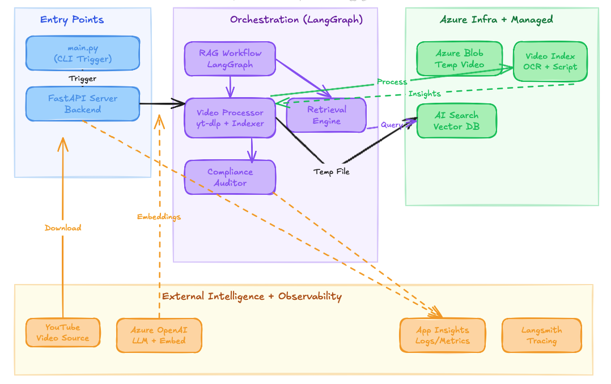

# SpeechGuard

A scalable, cloud-native engine for automated compliance and hate speech detection in video content, powered by Azure AI, LangGraph, and modern frontend technologies.

---

## Features

- **Automated Video Ingestion** from YouTube and other sources
- **Azure Video Indexer** for OCR and transcript extraction
- **RAG Workflow** using LangGraph for orchestration
- **Compliance & Hate Speech Detection** with LLMs and custom rules
- **Vector Search** with Azure AI Search
- **Modern React Frontend** for audit submission and results visualization
- **Observability** via Azure Application Insights and Langsmith

---

## Architecture

---

## Frontend Preview

---

## Azure Insights
![Azure Insights][Azure Observability.png]